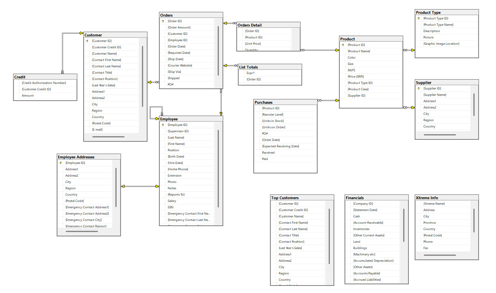

<h1>SQL Data Quality Project</h1>

    This project demonstrates the process of importing data from Microsoft Access into Microsoft SQL Server, validating data quality, identifying relationships between tables, and building a relational database model.

	
    The project focuses on data validation, referential integrity checks, anomaly detection, and data quality assessment.

## Data Source

The original database was provided as a Microsoft Access file and imported into Microsoft SQL Server.

Database structure and column definitions can be found in:

`database/database_structure.csv`

## Project Structure

- `database/FunData.mdb` - original Microsoft Access database
- `database/FunData.xlsx` - exported tables from database
- `sql/` - database scripts
- `screenshots/` - screenshots

## Project Steps

### 1. Data Import

- Imported data from Microsoft Access into Microsoft SQL Server.
- Examined database structure and column data types.

### 2. Relationship Analysis

Identified potential primary keys and foreign keys based on table structure and business logic.

### 3. Check Orphan Records

Performed orphan record checks using LEFT JOIN validation queries.

#### Finding

One orphan record was identified in Orders table:

- Order ID: 3122
- Customer ID: 200

The customer record did not exist in the Customer table.

Related orphan records were also found in Orders Detail and List Totals.

For this portfolio project, the orphan order record was removed before implementing referential integrity constraints.

In a production environment, the root cause would be investigated before any data modification.

### 4. Check Data Quality

Performed the following validation checks.

#### Data Quality Findings

1. Orphan customer reference detected and resolved.
2. 8 customer records with missing postal codes.
3. M/F product classification field populated for only 18 of 115 products.

## Additional Tables

The database contains several supporting tables that are not directly connected to the main transactional model:

1. Top Customers
2. Xtreme Info
3. Financials

## Entity Relationship Diagram

The final ERD is shown below.

## Tools Used

- SQL Server Management Studio (SSMS)
- Microsoft Access
- Microsoft Excel
- Visual Studio Code
- GitHub
